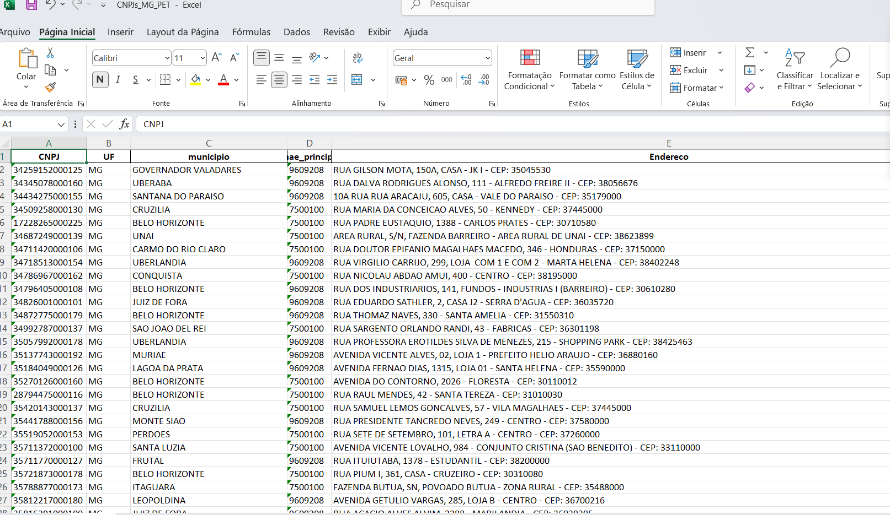

#  Filtragem e Estruturação de Dados Públicos de Empresas (CNAE + UF)

Este projeto é um script em Python que automatiza a leitura, filtragem e organização de grandes volumes de dados públicos de empresas brasileiras, com base nos arquivos disponibilizados pelo governo federal (como os arquivos `PLAN*.ESTABELE` e a base de municípios).

> ⚠️ Aviso Legal: Este projeto utiliza exclusivamente dados públicos extraídos do portal de dados abertos da Receita Federal do Brasil. Não são utilizados dados sensíveis ou de pessoa física, em conformidade com a LGPD (Lei Geral de Proteção de Dados - Lei nº 13.709/2018).


---



##  O que o script faz

- Lê arquivos CSV massivos (com milhões de linhas) de forma eficiente
- Filtra apenas os registros de **empresas ativas** com **CNAEs específicos**
- Permite limitar os dados por **estado (UF)**
- Concatena corretamente o CNPJ completo
- Monta um endereço padronizado com base nos campos do arquivo
- Formata telefones e e-mails
- Realiza merge com a base de municípios para trazer o nome da cidade
- Exporta os dados processados para um **arquivo Excel (.xlsx)**, automaticamente dividido em abas quando necessário

---

##  Exemplos de uso

- Obter a lista de empresas de contabilidade ativas em Minas Gerais
- Gerar uma base de contatos por setor e UF para prospecção
- Auxiliar análises tributárias e de mercado regional
- Suporte a escritórios contábeis, jurídicos ou consultorias de dados

---

##  Como configurar

No início do script, você deve editar os seguintes parâmetros:

```python
# Caminho da pasta onde estão os arquivos
BASE_DIR = r"CAMINHO/DA/SUA/PASTA"

# Nome do arquivo de municípios (.CSV separado por ;)
MUNICIPIOS_FILENAME = "MUNICIPIOS.MUNICCSV"

# Nome do arquivo de saída Excel
OUTPUT_FILENAME = "CNPJs_filtrados.xlsx"

# Lista de CNAEs que deseja filtrar
CNAES_CONTABILIDADE = ["6920601", "6920602", "7020400"]

# Situação cadastral (normalmente "02" para empresas ativas)
SITUACAO_ATIVA = "02"

# Estado que deseja filtrar (ex: "MG", "SP")
UF_FILTRADA = "MG"

```

Você irá precisar dos arquivos com os dados, que são disponibilizados no 
portal gov.br. São um total de 10 arquivos que contêm os dados do CNPJ 
e um arquivo com o código de todos os municípios, para padronizar e evitar erros 
chamei os arquivos com o padrão PLAN1.ESTABELE e assim sucessivamente.

link para download:
```text
https://arquivos.receitafederal.gov.br/dados/cnpj/dados_abertos_cnpj/?C=N;O=D
```

# 🖥️ Como rodar o script
Clone este repositório:

```bash 
git clone https://github.com/seu-usuario/seu-repo.git

```
## Instale as dependências:

```bash 
pip install pandas openpyxl
```
## Execute o script:

```bash
 python script.py


